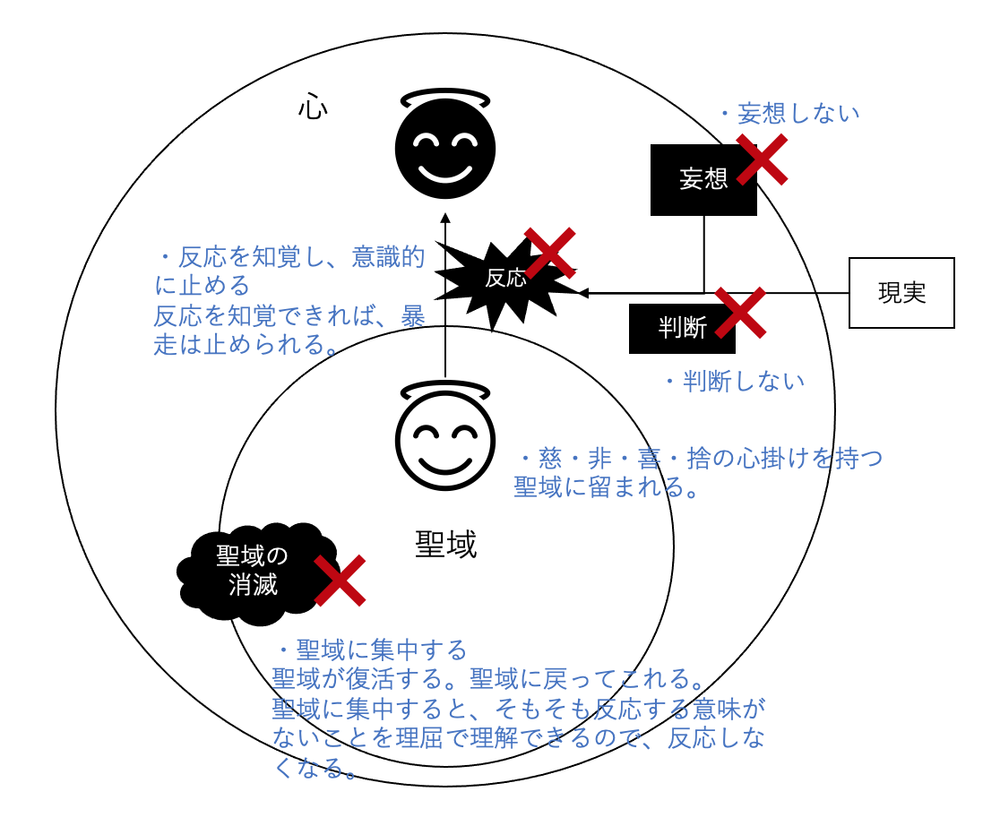

聖域から出てはいけない。聖域はスローガン、原理原則、理念、行動指針としてまとめた。


# スローガン
ほどほどに意味のある人生を、低ストレスで。

# 原理原則
人生はものすごく短くて、思い通りにならない。

## 「我々はみんなもうすぐ死ぬ。」

長い目で見れば、僕たちはみんな死んでいる。

人生はたった4000週間しかない。

ほとんど全てのことを達成できず、歴史に名を残すこともなく、すぐに死ぬ。


## 「未来はコントロールできない。」

急げば急ぐほど、時間のかかる仕事（あるいは幼児の世話）にイライラする。

計画を完璧にこなそうとすればするほど、小さな不確定要素への恐怖が高まる。

時間を自分の自由に使おうとすればするほど、人生は孤独になっていく。

# 注意が必要な誤解
タイムマネジメントを極め、今の時間を有効活用できれば、いつか理想の世界が訪れるという誤解。

人生はものすごく短くて、思い通りにならないから、今を犠牲にしても理想の世界は絶対に訪れない。

代わりに今を生きることができなくなり、未来のことしか考えられなくなる。

つねに計画がうまくいくかどうかを心配し、何をやっても将来のためになるかどうかが頭をよぎる。

いつも効率ばかりを考えて、心が休まる暇はない。

時間の物差しを捨ててリアルな現実に飛び込んでいくときの魔法のような感覚は、もうどうやっても手が届かない。

「喜びなき切迫感」が日々を覆い尽くし、目先の目標を達成しても、次なる理想が生まれ「もっとやらなければ」という焦りが一瞬も消えない。

# 理念
## 「自分には限界がある」
人生はものすごく短い。何もかもはできない。偉業は達成できない。ほとんど全てのチャンスを逃す。

未来はどう転ぶかわからない。挑戦は失敗に終わるかもしれない。自分の才能のなさが露呈するかもしれない。恥をかき、気まずい会話をし、せっかくの期待を裏切ってしまう可能性も高い。

これらは当たり前の現実であり、考えてもどうにもならない。

自分は主人公じゃない。あたかも自分が物事を決める立場にいるかのような幻想を捨てる。（自己中心性バイアスの罠）

## 「時間はかかるだけかかる」
何事にもちょうど良いタイミングというものがある。

時間は自分の持ち物で「使えるもの」という考えをやめ、時間に使われると考える。

計画通りにスケジュールをこなす人生ではなく、歴史の中の現在に身を置き、その時々の必要に応えて生きてみる。

自分が主導権を握っているという幻想を捨て、現実のペースに身を委ねる。

自分は限られた時間であり、死へ向かっていく存在であり、いつ死ぬかもわからない。

存在することの驚きと、そのあまりの短さに思いを馳せて、今ここで時間の流れの中にいることが、不可解なほどに奇跡的なことだと理解する。

# 行動指針
## 「注意力を自分の手に取り戻す」
現実は注意力によって作られる。あなたの人生とはすなわち、あなたが注意を向けたあらゆる物事の総体である。

どんなに恵まれた環境にいても、注意の使い方によっては、何の意味もないみじめな人生を送ってしまう。

意味のある体験をするためには、その体験に注意を向けなければならない。

だが、心からやり遂げたいと思っていることでも、なぜか集中できないことがある。

重要なことに取り組むとき、僕たちは自分の限界を痛感する。時間が限られていて、コントロールできない事実を肌で感じる。

思っていたほど才能がないかもしれないし、人間関係は思わぬ泥沼にはまり込むかもしれない。仮に全てがうまくいくとしても、そうなることを事前に知ることはできない。

人は、物事をコントロールできないという不快な真実に直面したとき、強烈な忌避反応を起こす。

この苦痛から逃れるために、気を紛らわせてくれる何を探してしまう。スマートフォンに手を伸ばし、テック企業に注意を奪われてしまう。

ものごとは理想的でない形で展開していく。僕たちにできるのは、その事実を受け入れ、現実に身を任せることだけだ。

この苦痛に抵抗するのではなく、逃れようとするのではなく、受け入れる。

禅の教えでは、人の苦しみは全て、現実を認めたくないという気持ちから生じるのだという。

## 「まず自分の取り分をとっておく」
本当にやりたいことがあるのなら（創作活動でも、恋愛でも、社会運動でも）、確実にそれをやり遂げるための唯一の方法は、今すぐに、それを実行することだ。

どんなに石（自分のやりたいこと）が小さく見えても、どんなに他に大きな石があっても、そんなのは関係ない。

今やらなければ時間はないのだ。

## 「『進行中』の仕事を制限する」
最も重要な3つのことを選択したら、そのうちの一つが完了するまでは他の仕事は一切やらない。

## 「優先度『中』を捨てる」
人生でやりたいことトップ25をリストアップし、それを最も重要なものから順に並べ、そのうち上位5つに時間を使い、残りの20項目は捨てる。

何かを選択することは他の全ての選択肢を捨てると考えるのではなく、何か一つを選択できていることに感謝する（捨てる喜び）。


## 「問題がある状態を楽しむ」
「全ての問題を解決済みする」という達成不可能な目標を諦めよう。そうすれば、人生とは一つ一つの問題に取り組み、それぞれに必要な時間をかけるプロセスであるという事実に気づくはずだ。

## 「小さな行動を着実に繰り返す」
成果を焦らず、適切なペースを掴むために、1日に割り当てた時間が終わったら、すぐ手を止めて立ち上がる。

たとえエネルギーにあふれていて、もっとできると感じても、それ以上はやらない。

もう少しだけやりたいという欲望は、「終わらない状態への不満や、生産性が上がらないことへの焦り」を反映したものに他ならない。

途中で思いきってやめることで、忍耐の筋肉が鍛えられ、何度もプロジェクトに戻ってこれる。

その方が長期的に見れば、ずっと高い生産性を維持できるのだ。

## 「オリジナルは模倣から生まれる」
平凡な道が平凡に終わるわけではない。辛抱強くみんなと同じ道を歩んできた人だけがたどり着ける、豊かで独創的な境地というものもある。

3時間じっと絵画を見るのと同じで、まずは立ち止まり、その場に留まってみることだ。

現実を早めようとするのはやめて、現在地をゆっくりと楽しもう。

かけがえのない成果を手に入れるには、たっぷりと時間をかけることが必要なのだ。

## 「時間をシェアすると豊かになれる」
時間はネットワーク財でもある。それを使う人が増えれば増えるほど、その財から自分が得られる利益が増える。

時間がいくらあったところで、ひとりぼっちではあまり意味がない。

時間を意味のあることに使うためには、— 友達と遊んだり、デートをしたり、子供を育てたり、ビジネスを立ち上げたり、政治運動に参加したり、技術の進歩をもたらしたりするためには— 他人と協力することが不可欠だ。

そこには「自己が自分を超えて広がる」感覚があるという。


## 「自分を大きくする選択をする」
人生の重要な決断をするとき、「この選択は自分を小さくするか、それとも大きくするか？」と問い、大きくする選択をする。

## 「達成不可能なほど高い基準を自分に課さない」
達成不可能なほど高い基準で、自分の生産性やパフォーマンスを判断しない。

誰も達成できない（そして多くの人が他人には要求しようと思わない）ような基準を自分に課すのは暴力的な行為だ。

## 「あるべき自分を想定し、誰かに認めてもらおうとしない」
あるべき自分に縛られず、ありのままの自分でいる。

人はある年齢になると、衝撃的なことに、自分がどんな生き方をしようと誰も気にしていないことに気づく。人の期待に応えることばかり考え、自分を後回しにしてきた人にとって、これは非常に恐ろしい発見だ。自分のことを気にしているのは自分だけなのである。

## 「誰だって手探りだから、今すぐにやりたいことを始めよう」
まだ自信がないからと尻込みせず、始める。

たとえ経験や自信がなくてもやるのを諦める理由はどこにもない。

どうせいつまでたっても手探りで、確信のないままやるしかないのだから、尻込みしていても仕方ない。

## 「行動の結果を気にしない」
行動の結果を気にしない。時間をうまく使ったかは、結果の良し悪しで判断されない。（因果のカタストロフィーの罠）

結果を知りようがない事実を受け入れ、今日できる重要なことをやろう。


# 本のメモ
```

# イントロダクション
## 長い目で見れば、僕たちはみんな死んでいる

我々はみんなもうすぐ死ぬ。

人生はたった4000週間。

ほとんど全てのことを達成できず、歴史に名を残すこともなく、すぐに死ぬ。


# 現実を直視する
## なぜ、いつも時間に追われるのか

昔は時間の概念はなく、やるべきことが発生したら、ただそれに取り組んでいた。

産業が発達し、工場などの大人数による連携作業をコントロールするために時間が生み出され、働く時間に値段がつけられた。

それにより、時間は「使う」もので、有効活用しなければならないという考えが、人生の難易度を極端に引き上げてしまった。

「今」という時間を未来のゴールに辿り着くための手段に変えてしまった。

タイムマネジメントを極め、有効活用できれば、いつか理想の世界が訪れると錯覚してしまう。

この人生しかないということ、ものすごく短くて、思い通りにならない人生が、ただ一度きりのチャンスだという現実から目を背けることできる。

しかし実際は、未来をコントロールできない事実を突きつけられるたびに、ストレスを感じるだけだ。

急げば急ぐほど、時間のかかる仕事（あるいは幼児の世話）にイライラする。

計画を完璧にこなそうとすればするほど、小さな不確定要素への恐怖が高まる。

時間を自分の自由に使おうとすればするほど、人生は孤独になっていく。

「喜びなき切迫感」が日々を覆い尽くし、「もっとやらなければ」という焦りが一瞬も消えない。

時間の物差しを捨ててリアルな現実に飛び込んでいくときの魔法のような感覚は、もうどうやっても手が届かなくなる。

人生をもっと生産的に、楽しいものにするためには、自分には限界があるという事実を受け入れる必要がある。

「何もかもはできない」と認める。

どうせ全部はできないのだから、「選択肢を確保する」という誘惑に負けず、意識して選択する。

何かに時間を使うと決めたとき、僕たちはその他のあらゆる可能性を犠牲にしている。

それでも断固として、やる。

ほとんど全てのチャンスを逃すことは、当たり前の現実だ。

また、無理に急ごうとしないで「時間はかかるだけかかる」と思ったほうが、豊かな成果が生まれることもある。

何事にもちょうど良いタイミングというものがある。

つまり時間を「使う」という考えをやめる。

そもそも時間は自分の持ち物ではなく、時間に使われると考える。

計画通りにスケジュールをこなす人生ではなく、歴史の中の現在に身を置き、その時々の必要に応えて生きてみる。


# 幻想を手放す

## ちっぽけな自分を受け入れる
```
